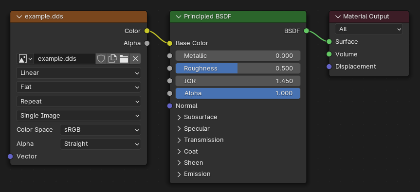

# OMSI Mesh Exporter for Blender

OMSI Mesh (`*.o3d`) exporter addon for
[Blender LTS](https://www.blender.org/download/lts/).

## Features

- Works on supported Blender versions
- Export direct from Blender - no converter required
- Cross-platform - works anywhere Blender and Python do
- No extraneous settings - never export left-handed Y-up again
- More capable:
  - No more tessellation errors
  - Merge material slots within or between meshes
  - Export meshes with more than 65535 vertices or triangles
  - Simultaneously have different Cycles, Eevee, and Export materials

## Download and Installation

1. Download the latest release for your Blender version from the
[releases page](https://github.com/Road-hog123/blender-omsi-exporter/releases/).
2. Launch Blender and go to `Edit` > `Preferences` > `Add-ons` > `Install`.
Select the `.zip` file you downloaded, then click `Install Add-on`.
3. Check the checkbox next to the addon to enable it.

## Reporting Issues and Enhancements

If you encounter a bug, please report the issue to the
[issue tracker](https://github.com/road-hog123/blender-omsi-exporter/issues).
Enhancement suggestions also go to the issue tracker.

If the error message starts with `Traceback`, go to `Window` >
`Toggle System Console` and copy the message (up until a blank line) into the
bug report. You'll need to toggle the console off before you close Blender.

If applicable, please include a `.blend` file that can be used to reproduce the
issue and verify the fix.

## Usage

The exporter can be found at `File` > `Export` > `OMSI Mesh (.o3d)`. Like most
exporters, it exports the current selection - hidden objects and non-mesh
objects will be excluded.

### Settings

`Merge Materials`
: Merges repeated material slots within and/or between objects. When merging
  only between objects, the repeat index (think `[matl]`) is considered, such
  that multiple objects with repeated materials merge correctly.

`Apply Transforms`
: Choose which transforms affect the mesh (and the animation origin). Improved
  from the `Use Submesh Local Pos. as Global Pos.` X converter setting. Hold
  Shift to toggle individual or select multiple options.

`Animation Origin`
: Includes the matrix for transforming the origin of an animation with
  `origin_from_mesh`.

`Skin Weights`
: Exports each object's vertex group weights as bone weights for smooth skin
  mesh deformation. Only non-zero weights and groups with a non-zero number of
  non-zero weights will be exported.

### Node-Based Material Setup

Blender's node-based materials are extremely powerful, which unfortunately leads
to complexity that is not possible to transfer to OMSI's simplistic materials.
As such, this exporter only supports a fairly strict node setup for exportable
materials.



The core of the setup is a Material Output node connected to a Principled BSDF
node. The parameters of the mesh materials are mapped to the shader node as
such:

- Diffuse (RGBA): Base Color (RGB) and Alpha (A) inputs†
- Specular (RGB): Specular input (greyscale)
- Emissive (RGB): Emission input
- Power: Roughness input, 0-1 converted to 1000-0
- Texture: Image Texture node connected to Base Color input‡

† Materials with textures are given an opaque white diffuse colour to avoid any
undesired shading effects arising from Blender's default off-white Base Color.

‡ The exporter searches the texture filepath left-to-right for a folder named
`texture` (case insensitive) and uses what comes after that folder. If it
doesn't find a `texture` folder, it just uses the filename.

Blender and OMSI use different rendering systems, so the appearance of the
material in Blender is not representative of the appearance in OMSI.

## Advanced Usage

With the Skin Weights setting enabled, the exporter includes all vertex groups
with a non-zero number of non-zero weights as bones, with the name of the group
being used as the name of the bone. If you have a use-case for needing to
exclude a group from export, please comment your use-case on this
[GitHub issue](https://github.com/Road-hog123/blender-omsi-exporter/issues/1).

The exporter uses Material Slots, so you can have multiple objects using the
same mesh but with different materials.

Once an image is loaded in Blender, you can edit the filepath and neither
Blender nor the exporter will resolve it - this means you can take a filepath
like `vehicles\bus\texture\regen.tga` and change it to
`vehicles\bus\texture\..\..\MAN_SD202\texture\regen.tga` and it will be exported
as `..\..\MAN_SD202\texture\regen.tga`.

### Advanced Node-Based Material Setup


A UV Map node can be connected to the Image Texture node to specify a UV Map to
use. If a UV Map with the specified name is not found, the exporter falls back
to the one determined by the `UV Map` advanced setting.

A Mapping node can be connected between the Image Texture and UV Map nodes to
deform the UV coordinates per-material rather than per-object as you can do with
the UV Warp modifier. `Point`, `Texture` and `Vector` options for `Type` are
supported, `Normal` is not.

Color and Value nodes can be connected to the shader node's inputs instead of
using the unconnected socket input controls. This is particularly useful in
conjunction with:

I have used the word "connected" not "linked" when talking about connecting
nodes - this is because I have rolled my own node tree processing code that
supports Node Groups, which result in connections between nodes being formed
from multiple links. Connections cannot stop at the boundary of a Node Group,
they have to be connected to an interesting node on both ends. Reroute Nodes
are not supported.

### Advanced Settings

The exporter supports presets, which allow you to save your current settings for
recall later. A quirk of presets is that they save all settings, including the
file path.

`SDK Compatibility`
: The SDK tools have not been updated to understand the newer versions of mesh
  file that OMSI 2 supports, so this setting is provided for exporting files the
  Crossing Editor can understand. Meshes with more than 65535 vertices or
  triangles will result in nothing being written.

`UV Map`
: In the case that there are multiple UV maps and the material does not specify
  one by name, the X exporter uses the selected ("active") UV map, but this
  setting allows for the use of the "active for render" UV map, which remains
  consistent regardless of what editing has occurred recently.

`Material Output Node Name`
: In the case that there are multiple material output nodes, the exporter will
  look for one to use that is named the same as this setting.

`Material Output Node Render Target`
: In the case that there are multiple material output nodes and there is not one
  whose name matches the name setting, the exporter will instead use the active
  material output node for the specified target render engine.

### Automating with Python Scripts

Exporting multiple mesh files from a single Blender file is a time-consuming
heavily-manual process, so automating the process can easily be beneficial.
Fortunately the Python API can also be used to automate Blender itself.

The typical way to do this is to programmatically perform the same actions that
a human user would:

```python
import bpy
from pathlib import Path

# deselect all objects
bpy.ops.object.select_all(action='DESELECT')
# select only the default cube
bpy.data.objects["Cube"].select_set(True)
# export the cube to the user's home folder with default settings
bpy.ops.export_scene.o3d(filepath=str(Path.home() / "example.o3d"))
```

Attempting to select an object that is not visible in the current view layer
will silently fail, while selecting an object that is not present in the current
scene will raise `RuntimeError`.

The file path should be an absolute path - relative paths are relative to the
folder containing `blender.exe`, not the folder where the blend file is saved,
and the startup scene does not have a save location.

While this approach should be fine for a file with a small number of mesh files
that have dissimilar settings, files with many similar objects (e.g. a bus with
scores of near-identical buttons) will get repetitive very quickly. For this
reason I have designed this addon such that you can directly import and use the
`Exporter` class from the `exporter` module:

```python
import bpy
from pathlib import Path
from io_export_o3d.exporter import Exporter

# create an exporter with default settings
exporter = Exporter()
# list of one object - the default cube
objects = [bpy.data.objects["Cube"]]
# same location as before
path = Path.home() / "example.o3d"
# export the file
exporter.export(objects, path)
```

This will work as expected for the default startup file where the default cube
has no modifiers, but you will find that adding modifiers has no effect on the
export result. This is because `bpy.data` provides access to the data inside the
blend file, which has only the undeformed source meshes. The runtime-evaluated
meshes with deforming modifiers applied are handled by the Dependency Graph or
[Depsgraph](https://wiki.blender.org/wiki/Source/Depsgraph):

```python
import bpy
from pathlib import Path
from io_export_o3d.exporter import Exporter

# get depsgraph for the current view layer
depsgraph = bpy.context.view_layer.depsgraph
# create an exporter with default settings
exporter = Exporter()
# list of one object - the default cube, but with deforming modifiers applied
objects = [depsgraph.objects["Cube"]]
# same location as before
path = Path.home() / "example.o3d"
# export the file
exporter.export(objects, path)
```

For performance reasons the Depsgraph only evaluates the currently visible
objects (hence it is retrieved from the current view layer), which means that
attempting to retrieve objects that are not visible or present in the current
view layer will raise `KeyError`.

`Exporter`'s arguments are optional keyword-only arguments to specify the export
settings, which default to the same values as the UI.

`export()` must be called with an Iterable of objects, even when exporting only
a single object. The objects will be written to the file in the order they are
provided, so you need to be careful to get the order you want - the scene and
collection lists are not guaranteed to be in alphabetical order. The `Exporter`
class method `sort_objects()` is provided to sort objects by name. The file path
is a `pathlib` Path, not a string.

A few additional useful things:

```python
# get folder containing the blend file
root = Path(bpy.data.filepath).parent
# switch scene
bpy.context.window.scene = bpy.data.scenes["Example"]
# switch view layer
bpy.context.window.view_layer = bpy.context.scene.view_layers["Example"]
```

#### Running Blender from the Command Line

If you're really into automating, you can run Blender from the [command line](
https://docs.blender.org/manual/en/latest/advanced/command_line/arguments.html):

```console
blender --background example.blend --python script.py
```

Blender will open in the background (i.e. no UI), open `example.blend`, run
`script.py`, and exit.
